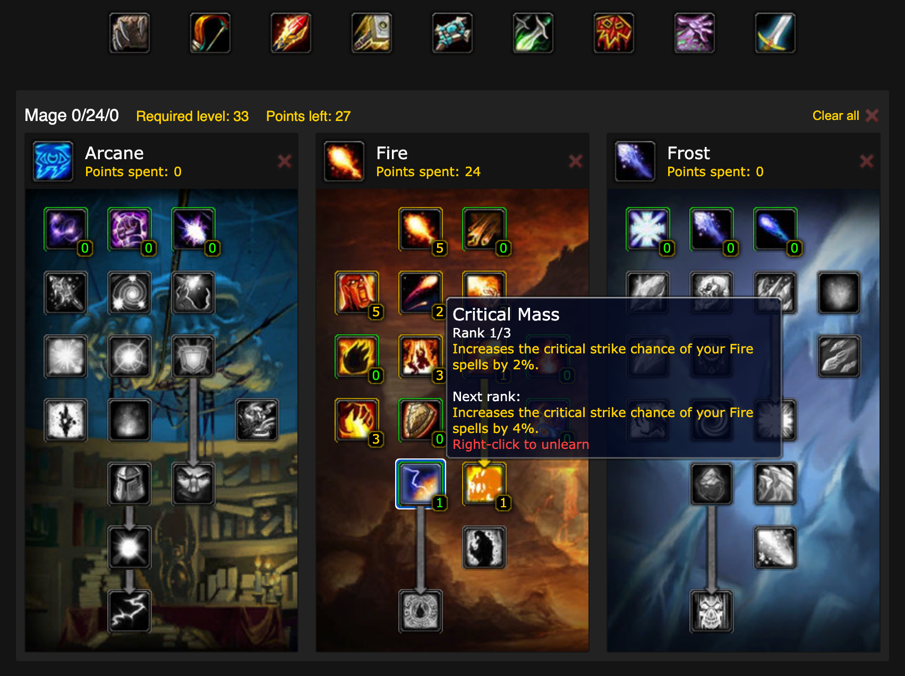

# Classic WoW Talent Calculator

CSS-grid based talent calculator, this has been forked a number of times by the private server community to make custom talent trees.

Check it out:
https://www.classiccalc.xyz/druid

## Features

- URL encoded app state (for shareable talent builds)
- Code splitting per class
- Viewport-aware tooltip
- Authentic, raster-based game assets used for UI

## Screenshots

